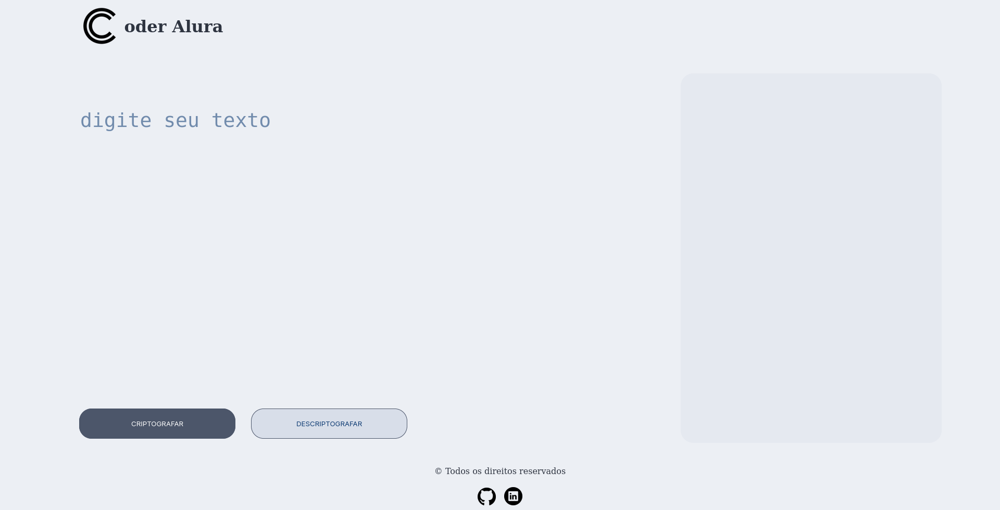

# <p align="center">One Cipher Works</p>

<p align="center">
<strong>Challenge ONE Sprint 01:</strong><br>
Construa um decodificador de texto com Javascript
</p>

<p align="center">
  <a href="#-tecnologias">Tecnologias</a>&nbsp;&nbsp;&nbsp;|&nbsp;&nbsp;&nbsp;
  <a href="#-projeto">Projeto</a>&nbsp;&nbsp;&nbsp;|&nbsp;&nbsp;&nbsp;
  <a href="#-layout">Layout</a>&nbsp;&nbsp;&nbsp;|&nbsp;&nbsp;&nbsp;
  <a href="#-demonstração">Demo</a>&nbsp;&nbsp;&nbsp;|&nbsp;&nbsp;&nbsp;
  <a href="#memo-licença">Licença</a>
</p>

<p align="center">
  
</p>

<br>

<p align="center">
  
</p>


## 🚀 Tecnologias

Esse projeto foi desenvolvido com as seguintes tecnologias:

- HTML
- CSS
- JavaScript
- Git
- Github

## 💻 Projeto

Decodificador de texto desenvolvido durante o desafio do Projeto ONE da Oracle+Alura LATAM. O objetivo deste desafio é criar uma página web que seja capaz de criptografar e descriptografar textos digitados pelo usuário, apresentando o resultado em sua forma correspondente. O desafio tem como propósito testar e avaliar os conhecimentos adquiridos durante o curso "Iniciante em Programação".

### :lock: Chaves de criptografia

- As chaves de criptografia solicitadas são as seguintes:

```
A letra "a" é convertida em "ai".
A letra "e" é convertida em "enter".
A letra "i" é convertida em "imes".
A letra "o" é convertida em "ober".
A letra "u" é convertida em "ufat".
```

### :ballot_box_with_check: Requisitos

- Deve funcionar apenas com letras minúsculas.
- Não devem ser utilizadas letras com acentos ou caracteres especiais.
- Deve ser possível converter uma palavra para a versão criptografada e também retornar uma palavra criptografada para sua versão original.

```
Por exemplo:
"gato" => "gaitober"
"gaitober" => "gato"
```
- A página deve ter campos para inserção do texto que será criptografado ou descriptografado, e o usuário deve poder escolher entre as duas opções.
- O resultado deve ser exibido na tela.

#### Extras:

- Um botão que copie o texto criptografado/descriptografado para a área de transferência, ou seja, que tenha a mesma funcionalidade do Ctrl+C ou da opção "copiar" do menu de aplicativos.

## 💻 Demonstração

https://pass0n.github.io/one_cipher_works/

## 🔖 Layout

Você pode visualizar o layout do projeto através do [link no Figma](https://www.figma.com/file/tvFEYhVfZTjdJ5P24RGV21/Alura-Challenge---Desafio-1---L%C3%B3gica?node-id=16-802).

## :memo: Licença

Esse projeto está sob a licença MIT.

---
